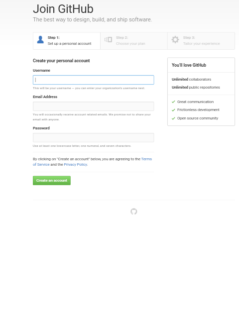
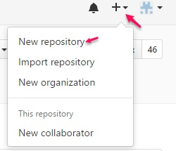
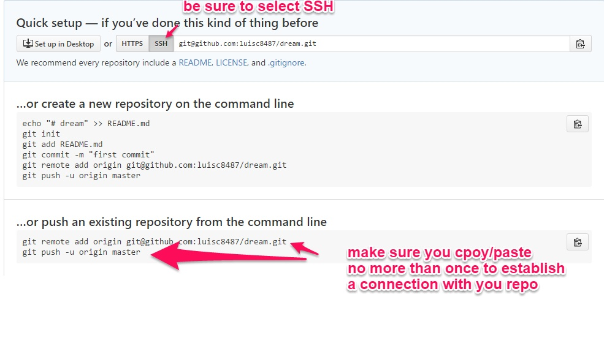
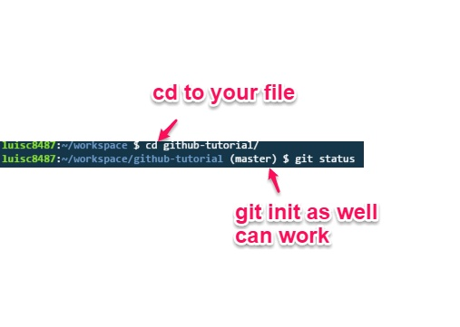

# GitHub Tutorial

_by Luis Cordero_

---
## Git vs. GitHub
The difference between Git and Github 
  
Git is basically taking a snapshots of 
code and it doesn't require GitHub. 
But Github requires Git. Github uses 
the [cloud](https://www.thecloud.net/),
an online server to store your work. 

---
## Initial Setup
Go to [github.com](https://github.com/) sign up. Make sure you sign for **free account**.
After doing three step setup, you have just made a github account.  

Keep in mind to remember your **password** and **username** for your github account. 

SSH keys are a way to identify trusted computers without involving passwords. 

---
## Repository Setup
How to create your first repo, only take a few steps. 
 
 First create a new repo on your github account,
 as seen on the images below. After giving the repo a name, 
 keep in mind the folder name of that repo has to be same (_case sensitive_)
 within your workspace of that specific folder you'll be working on. 
 
 

So now since we're in our workspace within [c9.io](https://c9.io/).
Lets create a file called README.md witht the use of `touch` command.
But before you create file `cd` into your file. By thew time you cd into your file
master branch must appear within bash. This tells the user that the file is a repository
or another way you7 could have create a repository would be `git init`.

After create the file, open the file and edit it. 
Since you modified your file up the file on the staging area, 
in other words `git add [file]`. Git add, adds file to the staging area.

Now `git commit -m ` in order to tap a snapshot of an changes to the file/folder.
Last git push use the existing repository from the command line or the image above.

---
## Workflow & Commands